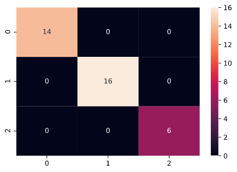

# [Project 1: Cell Hashing to Demultiplex Cells at the Single Cell Resolution](https://github.com/poronburman/Cell-Hashing-to-Demultiplex-Cells-at-the-Single-Cell-Resolution)

# Cell Hashing to Demultiplex Cells at the Single Cell Resolution

In this project, I've reanalyzed the data generated from the published paper https://genomebiology.biomedcentral.com/articles/10.1186/s13059-018-1603-1.

The published paper is saved in the 'Paper' folder.    
The Rmd and html scripts are saved in the 'Script' folder.    
The figures generated from the script are saved in the 'Figures' folder.

The authors of this paper introduce a new method for scRNA-seq multiplexing, where cells are labeled with sample-specific oligonucleotide tagged antibodies (HTOs) directed against immune surface markers (CD45, CD98, CD44, and CD11a). These HTOs contain unique 12bp barcode that can be sequenced alongside the cellular transcriptome.

The experiment was designed in a way where CITE-seq and Cell Hashing was performed simultaneously, yet generating separate sequencing libraries. In their proof-of-principle experiments, they obtained peripheral blood mononuclear cells (PBMCs) from eight separate human donors (donors labelled A through H) and each sample was stained with a different HTOs-conjugated antibody. The samples were pooled and run in a single lane on the 10X Genomics Chromium Single Cell 3' v2 system; expecting a yield of 20,000 single cells and generation of transcriptome, HTO, and ADT libraries. The cells were sequenced on the Illumina platform and the demultiplexing step was performed using the Seurat software.

**Highly expressed HTOs**       
Based upon the maximum HTO signal, HTO-A and HTO-B seem to be the most highly expressed.

**Mutual exclusivity of HTO-A and HTO-B**    
Observing the Feature Scatterplot between HTO-A and HTO-B, one can observe that there isn't mutual exclusivity between the HTOs.

    

**Comparing the number of UMIs**    
The number of UMIs for Doublets and Negatives are less as compared to Singlets.

**tSNE representation of the HTO classification**    
The tSNE plot shows how Singlets are separated from Doublets.     

**Heatmap to represent the HTOs**    
The heatmap shows how the majority of the HTOs are exclusive for a specific patient sample.

Hence, this paper provides a very good and efficient approach for demultiplexing cells from multiple samples. This can help us to mix multiple samples with multiple different conditions and run them on the same 10X Chromium chip.

# [Project 2: Image Classification of Cat and Dog](https://github.com/poronburman/Image-Prediction)

1. This project uses Convolutional Neural Network to predict whether an image is a cat or a dog. 

2. This analysis can be used to accurately classify 2D images.

3. The convolutional neural network model used in this analysis was trained on 8000 images; each image being either a cat or a dog. After the model was trained, it was validated on 2000 images. The model was tested to predict whether the 2 images below are either a cat or a dog.

# [Project 3: Restaurant Reviews Classification](https://github.com/poronburman/Restaurant-Review-Classification)

1. This project uses Natural Language Processing and various Classification models to analyze and learn from the dataset consisting of past reviews of a restaurant. These reviews are classified as being positive or negative. The models can then be used to predict if any future review for that restaurant is a positive review or a negative one. 

2. The dataset consists of 1000 rows and 2 columns; where each row is a single review for a particular restaurant. The first column has the review and the second column classifies the review as either 0 or 1, 0 representing negative review and 1 representing positive review.

3. The data analysis for this project followed the following sequential steps:
* Remove punctuations and stop words from each review.    
* Convert all words to lowercase.    
* Create a sparse matrix of the dataset.    
* Divide the dataset into training and testing data.    
* Apply the Classification model.    
* Present the Data Analysis results: Confusion Matrix and Classification Report.    

4. Logistic Regression Classification model performed best in this project and can be used to classify any future reviews for this restaurant as positive or negative.   

5. Listed below are the Confusion Matrix and Classification Report of the various Classification models used in this project, arranged in order of decreasing accuracy:    

## Logistic Regression

**Confusion Matrix**    
    

**Classification Report**    

## K Nearest Neighbors Classifier   

**Confusion Matrix**    

**Classification Report**    
    

## Support Vector Machine    

**Confusion Matrix**    
  

**Classification Report**    
    

## Random Forest    

**Confusion Matrix**    
  

**Classification Report**    
    

## Kernel SVM    

**Confusion Matrix**    
  

**Classification Report**    
    

## Decision Tree    

**Confusion Matrix**    
  

**Classification Report**    
    

## Naive Bayes    

**Confusion Matrix**    
  

**Classification Report**    

# [Project 4: Wine Quality Customer Segmentation](https://github.com/poronburman/Wine-Quality-Segmentation)

1. This project uses different dimensionality reduction and classification models to predict and segment the customers who are trying to buy wine of different qualities.

2. The analysis was performed in the following sequential steps:

* Used PCA and logistic regression to predict and visualize to which wine category a customer will belong to.

* Used LDA and logistic regression to predict and visualize to which wine category a customer will belong to.

* Used Kernel PCA and logistic regression to predict and visualize to which wine category a customer will belong to.

# [Project 5: Earmarking Mall Customers](https://github.com/poronburman/Customers-Clustering)

1. This project used different clustering techniques to specifically target customers who visited a Mall.
2. This analysis can be used to sell products to specific group of customers, based upon their annual salary and spending score.
2. The dataset has the attributes of the customers who visited a Mall; consisting of their annual salary and spending score.
3. The analysis was performed in the following sequential steps:

* Find the number of clusters for K means clustering using elbow method    

* Plotting of the k means clustering groups of the customers

* Dendogram to find the number of clusters for hierarchial clustering

* Plotting of the hierarchial clustering groups of the customers

# [Project 6: SUV Car Purchase Prediction](https://github.com/poronburman/SUV-Car-Purchase-Prediction)

1. This project uses data from customers who already bought a car from a dealership and uses various classification models to learn from the dataset, and to predict if any future customer will buy a SUV car from that dealership or not.  

2. K Nearest Neighbors, Artificial Neural Network, and Support Vector Machine classification models classified the data most accurately. These three classification models can be used to predict any future customers at this dealership, if they have more chances of buying a SUV or not.    

3. The data analysis for this project followed the following sequential steps:
* Split the dataset into training and testing data.    
* Scale the data.     
* Apply the classification model.    
* Predict the result.    
* Present the Data Analysis results: Confusion Matrix and Classification Report.    

4. Listed below are the Confusion Matrix and Classification Report of the various Classification models used in this project, arranged in order of decreasing accuracy:

## K Nearest Neighbor

**Confusion Matrix**    
    

**Classification Report**    

## Artificial Neural Network   

**Confusion Matrix**    

**Classification Report**    
    

## Kernel Support Vector Machine    

**Confusion Matrix**    
  

**Classification Report**    
    

## Logistic Regression    

**Confusion Matrix**    
  

**Classification Report**    
    

## Naive Bayes    

**Confusion Matrix**    
  

**Classification Report**    
    

## Random    

**Confusion Matrix**    
  

**Classification Report**    
    

## Support Vector Nachine    

**Confusion Matrix**    
  

**Classification Report**    

# [Project 7: Startups Profitability](https://github.com/poronburman/Startups-Profitability)

1. This project analyzes various features of 50 start up companies and uses various regression models to find the most profitable startup company to invest in.

2. Random Forest Regression model had the best goodness of fit in this project. This means that this model can be used to predict which startup companies will be the most profitable, when provided the same data for those companies.

2. The dataset has 50 rows, where each row has information for a particular startup company. Each column represents an attribute of the startup company.

3. The analysis for this project was performed in the sequential manner:
* Encode categorical variable.        
* Split the dataset into training and testing data.    
* Apply the regression model.   
* Predict the result and check the goodness of fit of the regression model.   

3. Here are the R squared score of the different regression models used in this analysis.

    

